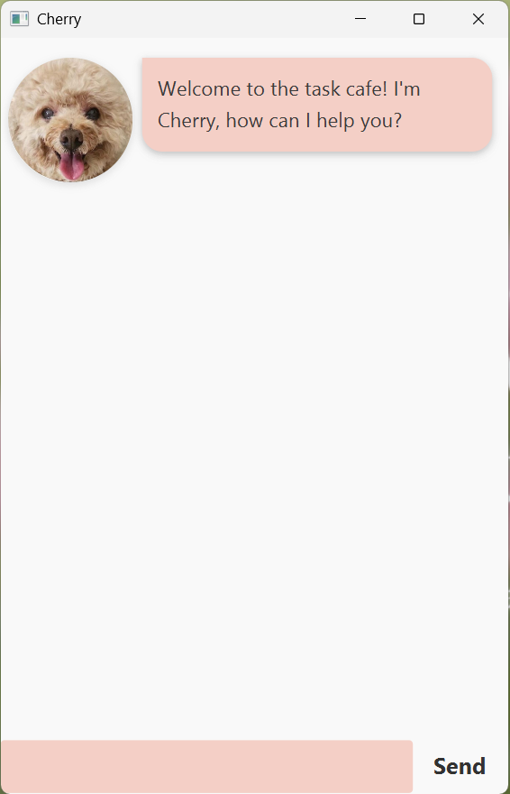

# Cherry's Task Café ☕

**Cherry** is a desktop task management app styled as a cosy café, where your tasks
are "orders" and Cherry is your barista. It works as both a Command Line Interface
(CLI) application and a Graphical User Interface (GUI) application.

---

## Quick Start

1. **Ensure you have Java 17 or above** installed on your computer.

2. **Download the latest `.jar` file** from
   [here](https://github.com/shainegan1407/ip/releases).

3. **Launch the app** by double-clicking the jar file, or run:
```
   java -jar cherry.jar
```

4. **A GUI similar to the below should appear** in a few seconds:
   

5. **Type a command** in the text field at the bottom and press **Enter** or
   click **Send**.

6. Refer to the [Features](#features) section for details of each command.

---

## GUI Overview

| Element | Description                                        |
|---------|----------------------------------------------------|
| **Your messages** | Appear on the **right** with a white bubble        |
| **Cherry's responses** | Appear on the **left** with a light blue bubble    |
| **Errors** | Red bubble to catch your attention                 |
| **Successes** | Green bubble to confrim completed actions          |
| **Warnings** | Orange bubble for actions that need your attention |
| **Auto-scroll** | Chat scrolls to the latest message automatically   |
| **Resizable window** | Messages resize as the window is resized           |

---

## Features

### Notes about command format

- **Words in `UPPER_CASE`** are parameters you supply.
    - Example: `todo DESCRIPTION` → `todo read book`
- **Items in square brackets are optional.**
    - Example: `update 1 [/desc DESCRIPTION]` → `update 1 /desc new name`
- **Date format:** All dates must use `yyyy-MM-dd` (e.g. `2025-02-15`).
- **Task numbers** are positive integers starting from 1 (maximum 100).
- All commands are **case-insensitive**.

> ⚠️ If using a PDF copy of this guide, be careful copying multi-line commands —
> spaces may be lost.

---

## Commands

### `help` — View the menu

Displays all available commands.
```
help
```

---

### `todo` — Add a to-do

Adds a simple task with no date.
```
todo DESCRIPTION
```

**Examples:**
```
todo read book
todo buy coffee beans
```

**Response:**
```
✓ Order placed! ☕
read book
Total items on your list: 1
```

---

### `deadline` — Add a deadline

Adds a task that must be completed by a specific date.
```
deadline DESCRIPTION /by DATE
```

- `DATE` must be in `yyyy-MM-dd` format.
- Dates in the past will show a warning.

**Examples:**
```
deadline submit report /by 2025-12-31
deadline return book /by 2025-03-15
```

**Response:**
```
✓ Order placed!
return book
  ☕ Due: 15 Mar 2025
Total items on your list: 2
```

---

### `event` — Add an event

Adds a task that spans a time range.
```
event DESCRIPTION /from START /to END
```

- `/from` must appear before `/to`.
- Start and end times cannot be identical.

**Examples:**
```
event project meeting /from 2pm /to 4pm
event team lunch /from Monday 12pm /to Monday 2pm
```

**Response:**
```
✓ Order placed!
project meeting
  ☕ 2pm → 4pm
Total items on your list: 3
```

---

### `list` — View all orders

Displays your complete task list as a café order list.
```
list
```

**Response:**
```
📋 YOUR CAFÉ ORDER LIST 📋

#01 │ ○ PREPARING
    read book
┈┈┈┈┈┈┈┈┈┈┈┈┈┈┈┈┈┈┈┈┈┈┈┈┈┈┈┈┈┈┈┈┈
#02 │ ✓ READY
    return book
    ☕ Due: 15 Mar 2025
┈┈┈┈┈┈┈┈┈┈┈┈┈┈┈┈┈┈┈┈┈┈┈┈┈┈┈┈┈┈┈┈┈
#03 │ ○ PREPARING
    project meeting
    ☕ 2pm → 4pm

Total: 3 orders │ ✓ 1 ready │ ○ 2 preparing
```

---

### `find` — Search orders

Finds all tasks whose description contains the keyword.
```
find KEYWORD
```

- Search is **case-insensitive**.
- Matches substrings (e.g. `book` matches `read book`).

**Examples:**
```
find book
find meeting
```

**Response:**
```
Found 2 matching order(s):
1. ○ PREPARING │ read book
2. ○ PREPARING │ return book
                  ☕ Due: 15 Mar 2025
```

---

### `mark` — Mark an order as done

Marks the task at the given index as completed.
```
mark INDEX
```

**Examples:**
```
mark 2
```

**Response:**
```
Order complete! Great work!
✓ return book
  Was due: 15 Mar 2025
Time for a coffee break? ☕
```

---

### `unmark` — Mark an order as not done

Marks the task at the given index as incomplete.
```
unmark INDEX
```

**Examples:**
```
unmark 2
```

**Response:**
```
Back to preparing this order:
○ return book
  Due: 15 Mar 2025
```

---

### `update` — Edit an existing order

Modifies one or more fields of an existing task.
```
update INDEX [/desc DESCRIPTION] [/by DATE] [/from TIME] [/to TIME]
```

- At least one field flag must be provided.
- Each flag may only appear once per command.
- Flags must be compatible with the task type:

| Task type | Allowed flags |
|-----------|--------------|
| Todo | `/desc` |
| Deadline | `/desc`, `/by` |
| Event | `/desc`, `/from`, `/to` |

**Examples:**
```
update 1 /desc buy oat milk
update 2 /by 2026-01-01
update 3 /from 3pm /to 5pm
update 3 /desc standup /from 9am /to 9:30am
```

**Response:**
```
Order updated!
○ buy oat milk
```

---

### `duplicate` — Copy an order

Creates an identical copy of an existing task and appends it to the list.
```
duplicate INDEX
```

**Examples:**
```
duplicate 2
```

---

### `delete` — Remove an order

Deletes the task at the given index.
```
delete INDEX
```

**Examples:**
```
delete 3
```

**Response:**
```
Order cancelled:
✗ project meeting
  2pm → 4pm
Remaining orders: 2
```

---

### `bye` — Close the café

Exits the application. Your data is saved automatically before exit.
```
bye
```

**Response:**
```
☕ Thanks for visiting Cherry's Café! ☕
Your orders are saved and ready for next time.
```

> **GUI:** The window closes automatically after a short delay.  
> **CLI:** The program exits immediately.

---

## Error Handling

Cherry validates all input and provides clear, specific error messages:

| Situation | Example error |
|-----------|--------------|
| Unknown command | `I don't recognise 'lst'. Did you mean 'list'?` |
| Missing description | `Your todo needs more details!` |
| Wrong date format | `'25-12-2025' is not in the right format. Please use yyyy-MM-dd.` |
| Non-existent date | `'2025-02-30' is not a valid date.` |
| Wrong field for task type | `This is a Todo task. You can only update: /desc` |
| Task number out of range | `Task number 99 is too high! Please use a number up to 100.` |
| Duplicate flag | `'/by' appears 2 times. Please use each flag only once.` |

In the GUI, errors appear in a **red bubble** so they are immediately visible.

---

## Data Management

### Automatic saving

Your tasks are saved automatically after every change. No manual saving is needed.

**File location:** `[JAR file location]/data/cherry.txt`

### File format
```
(T) | [ ] | task description
(D) | [X] | task description | 2025-12-31
(E) | [ ] | task description | start time | end time
```

### Manual editing

Advanced users may edit `data/cherry.txt` directly. Follow the exact format above,
using `|` as the separator.

> ⚠️ Back up the file before editing. Lines with invalid format are skipped on
> load and a warning is shown in the console.

---

## FAQ

**Q: How do I move my data to another computer?**  
Copy `data/cherry.txt` to the same location on the new computer.

**Q: Can I use both GUI and CLI modes with the same data?**  
Yes. Both modes read from and write to the same `data/cherry.txt` file.

**Q: What if I enter a date that has already passed?**  
Cherry will show an error: `That deadline has already passed! Are you sure you
want to add it?`

**Q: Are duplicate tasks allowed?**  
Yes. Tasks are identified by their index, not their description.

---

## Known Issues

1. **Multi-monitor setup:** Moving Cherry to a secondary monitor and later
   disconnecting it may cause the window to open off-screen. Delete
   `preferences.json` to reset the position.

2. **Very long descriptions:** Descriptions over ~100 characters may wrap
   awkwardly in the chat bubble. Keep descriptions concise for best results.

---

## Command Summary

| Action | Format |
|--------|--------|
| Help | `help` |
| Add todo | `todo DESCRIPTION` |
| Add deadline | `deadline DESCRIPTION /by DATE` |
| Add event | `event DESCRIPTION /from START /to END` |
| List all | `list` |
| Find | `find KEYWORD` |
| Mark done | `mark INDEX` |
| Mark undone | `unmark INDEX` |
| Update | `update INDEX [/desc D] [/by DATE] [/from T] [/to T]` |
| Duplicate | `duplicate INDEX` |
| Delete | `delete INDEX` |
| Exit | `bye` |

---

*Enjoy Cherry's Task Café — life is brewtiful when you're organised. ☕*